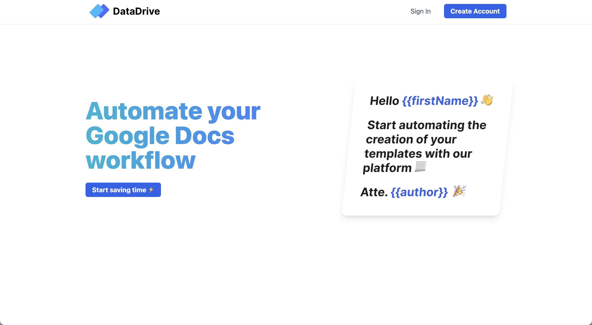

# Data Drive (Backend) 📝 📦
## Take a look of the code base of the this MVP (MERN). 
This is a REST API implemented with Express / MongoDB / Google API / Passport.

The problem that this app solves?
At work I am required to create templates on google drive, update the placeholders and download a pdf with the updated version... To much right? I decided to write an app that automates this process for me 🧠

**_IMPORTANT NOTE 1_**: The frontend of this web app can be found 
<a href="https://github.com/MIKEGUIJARRO/DataDriveFrontend" target="_blank"> 
   here.
  </a>
<h2 align="center">
  
  
   
</h2>

## Features 💡
⚡️ Cookie session\
⚡️ Google Auth 2.0\
⚡️ Protected routes\
⚡️ String Algorithms and Data Structures implemented \
⚡️ Error management
⚡️ Deployed on Heroku

To view this webpage, **[click here](https://datadrive.netlify.app/)**

## Technologies used 🛠️
- [Express](https://expressjs.com/) - Backend framework for web applications
- [MongoDB](https://www.mongodb.com/) - NoSQL database
- [Goodle API](https://www.npmjs.com/package/googleapis) - programmatic interfaces to Google Cloud Platform services
- [Algorithms and Data Structures](https://heroicons.com/) - High performance string recognition algo
-  [Heroku](https://www.heroku.com/) - a Cloud platform as a service supporting several programming languages

## Other resources 🧬
- [DataDrive API](https://github.com/MIKEGUIJARRO/DataDriveFrontend) - Frontend github repository

## Extra Info 👀
I was motivated to build this project because I wanted to speed up my work's pipeline. I work as a technology coordinator and I am required to create and share a lot of pdf that most of the time come from a "premade template". I thought it was going to be cool to automate this process and use it for my daily work. ⚡️